# StealthStash BETA

<u>Genaral info about the app. User Guide a bit below :)</u>

# Usage

1. Doublecklick the app icon and you will see "First launch window"
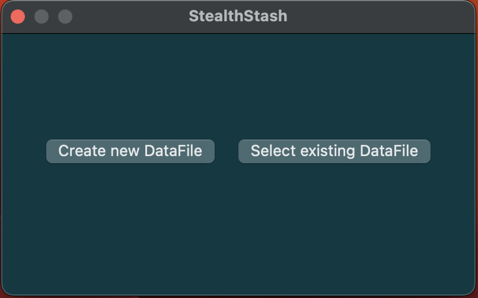

You will have two options:

        1. "Create new DataFile":

            You will be prompted to create a new password.
            
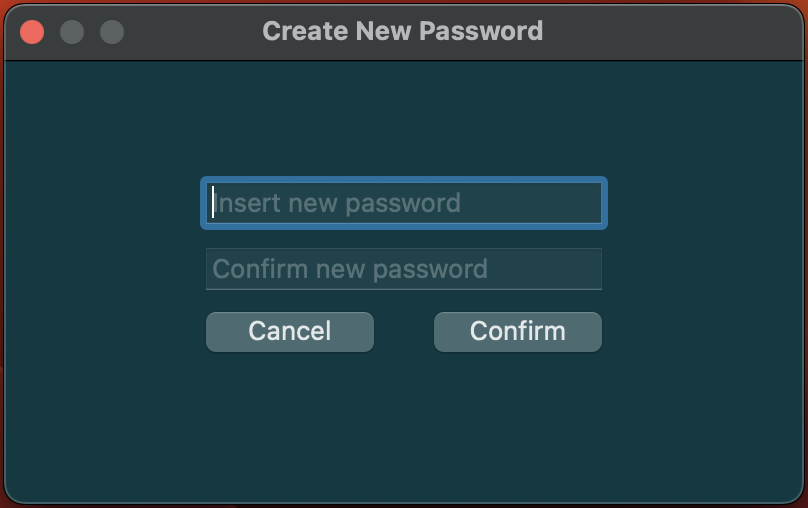

        2. "Select existing DataFile":

            You will be prompted to select already existing DataFile
            from your PC.
            (You have to know the password for this DataFile)

After selection the app either:

    - Will be restarted automatically on ARM machine
    or
    - Will be closed and should be relaunched manually on x86_64 machine.

2. After relaunch you will see the regular login window
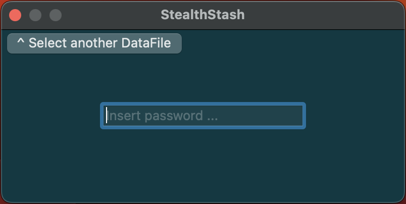

Pay attention:

You can change DataFile at every app launch or through
the "File" menu on the top bar.
The process is always the same, see - field "Usage 1.2" and below.

If the file was encrypted using another password or the
file was selected by mistake and was not created by this app,
you will get the following Error Message.

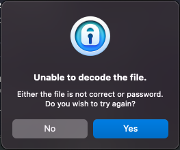

3. If the password was correct you will see the Main window
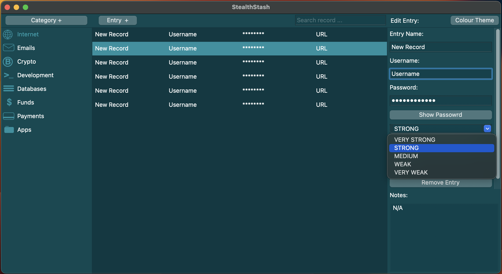

Here you can create New Category, New Entry and to alter each entry at the right panel. You can also automatically generate passwords with desired strength.

# Copy

In order to copy desired value you can either:

    1. Just doubleclick desired value (username, passsword, url) :)
    2. Select desired entry and use - top menu -> "Edit" -> Copy "Desired value"
    3. "Right click" on the entry and select Copy "Desired value"

# Search

There is a serach option at the top bar
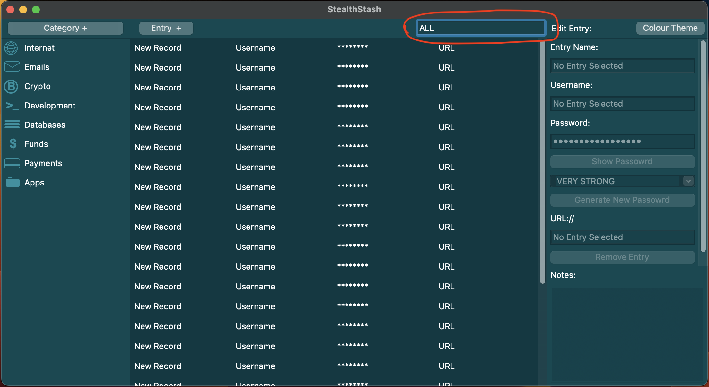

Search display all entries where "Record Name" or "Username" includes or equals to insert string. 

"ALL" is universal command. It displays all existing entries.

# Backup

The app makes backup for every data change and stores up to 100 backups
insode the app packages - "./.backup/"
Backup creates automatically once the app has been closed.
Name of each backup is a date and time of its creatin.

You can restore from backup using this option from top bar menu
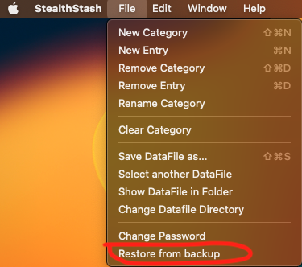

You will be prompted to select desired backup file.

Pay attention:

You have to know the password for selected backup file,
otherwise you will not be able to reach the data.

# Change Datafile Directory

By default the datafile stores inside the app packages - 
"./data/StealthStash.sdf"
But you can change default directory for datafile manually.
If you want to store the datafile in the "~/Documents/" for example, 
you can use:

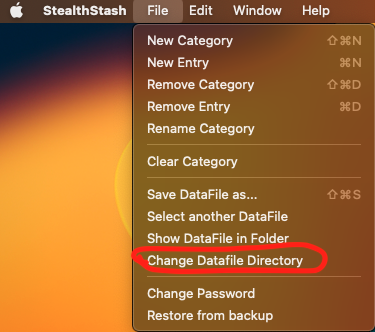

And choose the desired directory.

The application is build to store login credentials in the most secure way.

The password is NOT stored in any place nor the password hash. The password after adding
Initialization Vector and Salt is used to encrypt the data directly. 
Currently it is the most secure way to store the data.
But at the same time there is no way to restore password in case you forgot it.
Used AES 256 bit for encryption. 

If you don't have the password you won't be able to reach the data.

Datafile stores all your date in ecrypted way. 
Datafile - usually colled "StealthStash.sdf", but you can change it.
If you have the correct password, this application will decrypt
file, regardless of its name or extension.
The file written in regular text format (base64), so it can be stored in the cloud or in the email as backup.
No system will recognize it as a threat.

Datafile usually stored inside the App packages in 
"./data/StealthStash.sdf", but you can specify any
other directorey to store the file manually.

<u>In the future will be added option to encrypt files.</u>

# User Guide

You can either download ready app from ReadyAppARM64 or from ReadyAppX86_64, depending on your 
MAC OS and CPU type.
Or to assemble it on your own using the source code from this repo (if you consider this option
probably you know how to do it:).

Pay attention:

Version for ARM assembled and tested on Mac OS Ventura only and may not work on previous versions of Mac OS.
Version for x86_64 assembled and tested on Big Sure and will work on this OS and higher.

# Download

### Meanwhile only M1 version is working correctly.
### If you have x_86 processer, you have to clone the repo, install all dependencies and to build the app from scratch usinf 'py2app' utility.

1. Navigate to the app folder and Click on the file name.
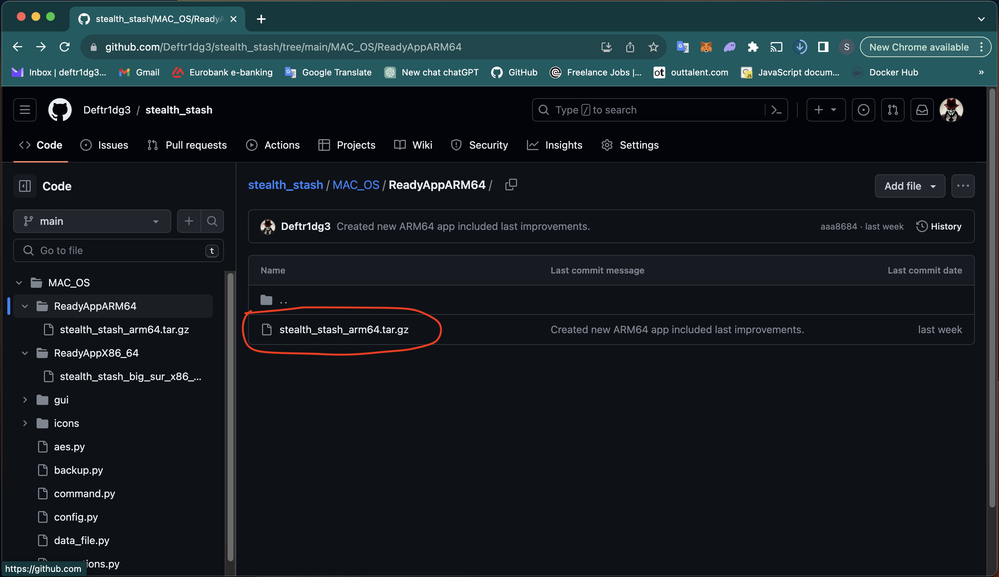

2. In the file repo click on "Raw" at the up right corner.
It will download the file.
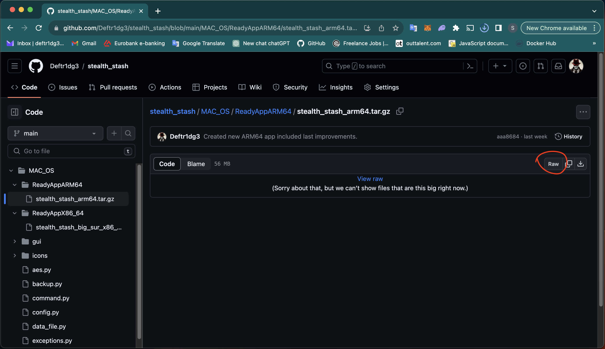

3. Open Terminal, navigate to Downloads folder and unpack it using terminal command:

    - tar -xzvf stealth_stash_arm64.tar.gz 

        or

    - tar -xzvf stealth_stash_big_sur_x86_64.tar.gz

    x - For extract

    z - For .gz format

    v - Verbose extracting process 

    f - specify file name

After extracting you will see the app Icon in your "Downloads" folder
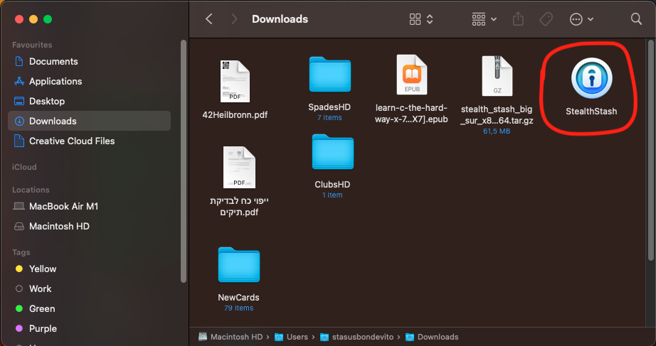

Now you can move the app either to "Applications" or
to any else desired directory.

To launch the app just Doubleclick it.

(First launch on x86_64 machine might take several seconds)

